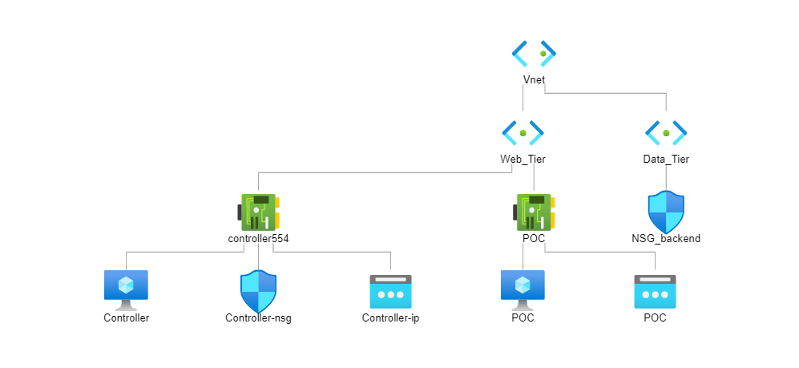

## Diagram:

## Installation:
    1- Install Terraform (https://learn.hashicorp.com/tutorials/terraform/install-cli?in=terraform/aws-get-started)
    2- Create azure account
    3- Install the Azure CLI and authenticate with Azure with the following command:
    4- Run command: az login

 This template building Windows VM with postgresSQL on azure using terraform code. On that infrastructure we are going to deploy a Node.js Weight Tracker App with Ansible.
input for variables for via .tfvars:

- VnetName               = ""
- admin_user_name        = ""
- admin_password         = "!"
- pg_user                = ""
- pg_pass                = ""
- address_space          = [""]
- addr_prefixes_Web_Tier = [""]
- addr_prefixes_Data_Tier= [""]
- RG                     = ""
- dns_postgresSQL        = ""
- dns_loadBalancer       = ""
- ip_connecter_via_RDP   = ""
- location               = ""

Input variables for port creation via .tfvars:

please notice if .tfvars file is needed to add to command: -var-file="{filename}.tfvars"

## Configuration with Ansible
Go to ansible folder and apply the steps that instructed in README.md

<!-- BEGIN_TF_DOCS -->
## Requirements

No requirements.

## Providers

| Name | Version |
|------|---------|
|  [azurerm](#provider\_azurerm) | 3.11.0 |

## Modules

No modules.

## Resources

| Name | Type |
|------|------|
| [azurerm_network_interface.network_int_web_Tier](https://registry.terraform.io/providers/hashicorp/azurerm/latest/docs/resources/network_interface) | resource |
| [azurerm_network_security_group.NSG_backend](https://registry.terraform.io/providers/hashicorp/azurerm/latest/docs/resources/network_security_group) | resource |
| [azurerm_network_security_group.NSG_frontend](https://registry.terraform.io/providers/hashicorp/azurerm/latest/docs/resources/network_security_group) | resource |
| [azurerm_postgresql_flexible_server.PosrgreSQLFlexibleDataServer](https://registry.terraform.io/providers/hashicorp/azurerm/latest/docs/resources/postgresql_flexible_server) | resource |
| [azurerm_postgresql_flexible_server_configuration.flexible_server_configuration](https://registry.terraform.io/providers/hashicorp/azurerm/latest/docs/resources/postgresql_flexible_server_configuration) | resource |
| [azurerm_postgresql_flexible_server_database.db](https://registry.terraform.io/providers/hashicorp/azurerm/latest/docs/resources/postgresql_flexible_server_database) | resource |
| [azurerm_postgresql_flexible_server_firewall_rule.postgres](https://registry.terraform.io/providers/hashicorp/azurerm/latest/docs/resources/postgresql_flexible_server_firewall_rule) | resource |
| [azurerm_private_dns_zone.Flexibale_Postgres_DataBase_DNS](https://registry.terraform.io/providers/hashicorp/azurerm/latest/docs/resources/private_dns_zone) | resource |
| [azurerm_private_dns_zone_virtual_network_link.someTestingWithDnsLink](https://registry.terraform.io/providers/hashicorp/azurerm/latest/docs/resources/private_dns_zone_virtual_network_link) | resource |
| [azurerm_public_ip.vmPublicIP](https://registry.terraform.io/providers/hashicorp/azurerm/latest/docs/resources/public_ip) | resource |
| [azurerm_resource_group.RG](https://registry.terraform.io/providers/hashicorp/azurerm/latest/docs/resources/resource_group) | resource |
| [azurerm_subnet.Data_Tier](https://registry.terraform.io/providers/hashicorp/azurerm/latest/docs/resources/subnet) | resource |
| [azurerm_subnet.Web_Tier](https://registry.terraform.io/providers/hashicorp/azurerm/latest/docs/resources/subnet) | resource |
| [azurerm_subnet_network_security_group_association.app_nsg_association_backend](https://registry.terraform.io/providers/hashicorp/azurerm/latest/docs/resources/subnet_network_security_group_association) | resource |
| [azurerm_subnet_network_security_group_association.app_nsg_association_frontend](https://registry.terraform.io/providers/hashicorp/azurerm/latest/docs/resources/subnet_network_security_group_association) | resource |
| [azurerm_virtual_network.vnet](https://registry.terraform.io/providers/hashicorp/azurerm/latest/docs/resources/virtual_network) | resource |
| [azurerm_windows_virtual_machine.vm_frontend](https://registry.terraform.io/providers/hashicorp/azurerm/latest/docs/resources/windows_virtual_machine) | resource |

## Inputs

| Name | Description | Type | Default | Required |
|------|-------------|------|---------|:--------:|
|  [RG](#input\_RG) | resource group name | `any` | n/a | yes |
|  [VnetName](#input\_VnetName) | VnetName | `string` | `"Vnet"` | no |
|  [addr\_prefixes\_Data\_Tier](#input\_addr\_prefixes\_Data\_Tier) | address prefixes | `list(any)` | n/a | yes |
|  [addr\_prefixes\_Web\_Tier](#input\_addr\_prefixes\_Web\_Tier) | address prefixes | `list(any)` | n/a | yes |
|  [address\_space](#input\_address\_space) | address space | `list(any)` | n/a | yes |
|  [admin\_password](#input\_admin\_password) | password for vm login | `string` | n/a | yes |
|  [admin\_user\_name](#input\_admin\_user\_name) | user name for vm login | `string` | n/a | yes |
|  [dns\_postgresSQL](#input\_dns\_postgresSQL) | DNS name for postgres | `string` | n/a | yes |
|  [ip\_connecter\_via\_RDP](#input\_ip\_connecter\_via\_RDP) | IP address from which yo will connect to controller | `string` | n/a | yes |
|  [location](#input\_location) | Azure location of terraform server environment | `string` | n/a | yes |
|  [pg\_pass](#input\_pg\_pass) | pg\_pass | `any` | n/a | yes |
|  [pg\_user](#input\_pg\_user) | pg\_user | `any` | n/a | yes |
|  [tags](#input\_tags) | tags | `string` | `"enviroment"` | no |

## Outputs

No outputs.
<!-- END_TF_DOCS -->