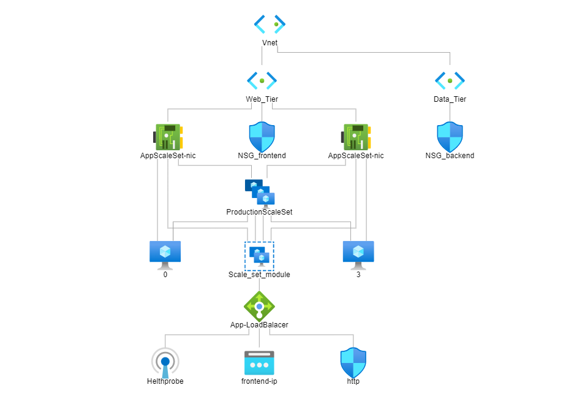

## Diagram:

## Installation:
    1- Install Terraform (https://learn.hashicorp.com/tutorials/terraform/install-cli?in=terraform/aws-get-started)
    2- Create azure account
    3- Install the Azure CLI and authenticate with Azure with the following command:
    az login

## Configuration
- Create an image with web app configuration based on this repository: https://github.com/LetsCreatProjects/bootcamp-app.git
- The configuration of the app you can find here: https://www.youtube.com/watch?v=LWPIdzeiThs
- For keeping app up at restart you can use pm2.

We will have 2 files of .tfvars type, one for staging and the second one for production.

To production, we will create 3 machines, where in staging will be 2.

 terraform_creating_elastic_scaleset_with_postgres is template that building an Elastic High Availability virtual network on azure with terraform code. On that infrastructure we are going to deploy a Node.js Weight Tracker App.
input for variables for via .tfvars:

- instance_num           = 
- VnetName               = ""
- ScaleSetName           = ""
- admin_user_name        = ""
- admin_password         = ""
- pg_user                = ""
- pg_pass                = ""
- address_space          = [""]
- addr_prefixes_Web_Tier = [""]
- addr_prefixes_Data_Tier= [""]
- RG    = ""
- dns_postgresSQL        = ""
- dns_loadBalancer       = ""
- ip_connecter_via_ssh   = ""
- location               = ""

please notice if .tfvars file is needed to add to command: -var-file="{filename}.tfvars"

After creating the 2 RGs, you need to configure postgresSQL manually and configure Weight Tracker Application using Ansible. 
Please Go to Ansible file and read "README.md" for further instructions.

<!-- BEGIN_TF_DOCS -->
## Requirements

| Name | Version |
|------|---------|
|  [terraform](#requirement\_terraform) | >= 1.2.2 |
|  [azurerm](#requirement\_azurerm) | ~> 2.65 |

## Providers

| Name | Version |
|------|---------|
|  [azurerm](#provider\_azurerm) | ~> 2.65 |

## Modules

| Name | Source | Version |
|------|--------|---------|
|  [Scale\_set\_module](#module\_Scale\_set\_module) | ./Scalsetmodule | n/a |

## Resources

| Name | Type |
|------|------|
| [azurerm_lb.App-LoadBalacer](https://registry.terraform.io/providers/hashicorp/azurerm/latest/docs/resources/lb) | resource |
| [azurerm_lb_backend_address_pool.Scale_set_module](https://registry.terraform.io/providers/hashicorp/azurerm/latest/docs/resources/lb_backend_address_pool) | resource |
| [azurerm_lb_outbound_rule.http](https://registry.terraform.io/providers/hashicorp/azurerm/latest/docs/resources/lb_outbound_rule) | resource |
| [azurerm_lb_probe.Helthprobe](https://registry.terraform.io/providers/hashicorp/azurerm/latest/docs/resources/lb_probe) | resource |
| [azurerm_lb_rule.AcceseRole](https://registry.terraform.io/providers/hashicorp/azurerm/latest/docs/resources/lb_rule) | resource |
| [azurerm_lb_rule.ssh](https://registry.terraform.io/providers/hashicorp/azurerm/latest/docs/resources/lb_rule) | resource |
| [azurerm_network_security_group.NSG_backend](https://registry.terraform.io/providers/hashicorp/azurerm/latest/docs/resources/network_security_group) | resource |
| [azurerm_network_security_group.NSG_frontend](https://registry.terraform.io/providers/hashicorp/azurerm/latest/docs/resources/network_security_group) | resource |
| [azurerm_postgresql_flexible_server.PosrgreSQLFlexibleDataServer](https://registry.terraform.io/providers/hashicorp/azurerm/latest/docs/resources/postgresql_flexible_server) | resource |
| [azurerm_postgresql_flexible_server_configuration.flexible_server_configuration](https://registry.terraform.io/providers/hashicorp/azurerm/latest/docs/resources/postgresql_flexible_server_configuration) | resource |
| [azurerm_postgresql_flexible_server_database.db](https://registry.terraform.io/providers/hashicorp/azurerm/latest/docs/resources/postgresql_flexible_server_database) | resource |
| [azurerm_postgresql_flexible_server_firewall_rule.example](https://registry.terraform.io/providers/hashicorp/azurerm/latest/docs/resources/postgresql_flexible_server_firewall_rule) | resource |
| [azurerm_private_dns_zone.Flexibale_Postgres_DataBase_DNS](https://registry.terraform.io/providers/hashicorp/azurerm/latest/docs/resources/private_dns_zone) | resource |
| [azurerm_private_dns_zone_virtual_network_link.someTestingWithDnsLink](https://registry.terraform.io/providers/hashicorp/azurerm/latest/docs/resources/private_dns_zone_virtual_network_link) | resource |
| [azurerm_public_ip.LoadBalacerPublicIp](https://registry.terraform.io/providers/hashicorp/azurerm/latest/docs/resources/public_ip) | resource |
| [azurerm_resource_group.RG](https://registry.terraform.io/providers/hashicorp/azurerm/latest/docs/resources/resource_group) | resource |
| [azurerm_subnet.Data_Tier](https://registry.terraform.io/providers/hashicorp/azurerm/latest/docs/resources/subnet) | resource |
| [azurerm_subnet.Web_Tier](https://registry.terraform.io/providers/hashicorp/azurerm/latest/docs/resources/subnet) | resource |
| [azurerm_subnet_network_security_group_association.NSG_backend_association](https://registry.terraform.io/providers/hashicorp/azurerm/latest/docs/resources/subnet_network_security_group_association) | resource |
| [azurerm_subnet_network_security_group_association.NSG_frontend](https://registry.terraform.io/providers/hashicorp/azurerm/latest/docs/resources/subnet_network_security_group_association) | resource |
| [azurerm_virtual_network.vnet](https://registry.terraform.io/providers/hashicorp/azurerm/latest/docs/resources/virtual_network) | resource |

## Inputs

| Name | Description | Type | Default | Required |
|------|-------------|------|---------|:--------:|
|  [RG](#input\_RG) | resource group name | `any` | n/a | yes |
|  [ScaleSetName](#input\_ScaleSetName) | ScaleSetName | `string` | `"AppScaleSet"` | no |
|  [VnetName](#input\_VnetName) | VnetName | `string` | `"Vnet"` | no |
|  [addr\_prefixes\_Data\_Tier](#input\_addr\_prefixes\_Data\_Tier) | address prefixes | `list(any)` | n/a | yes |
|  [addr\_prefixes\_Web\_Tier](#input\_addr\_prefixes\_Web\_Tier) | address prefixes | `list(any)` | n/a | yes |
|  [address\_space](#input\_address\_space) | address space | `list(any)` | n/a | yes |
|  [admin\_password](#input\_admin\_password) | password for vm login | `string` | n/a | yes |
|  [admin\_user\_name](#input\_admin\_user\_name) | user name for vm login | `string` | n/a | yes |
|  [dns\_loadBalancer](#input\_dns\_loadBalancer) | DNS name for Load Balancer | `string` | n/a | yes |
|  [dns\_postgresSQL](#input\_dns\_postgresSQL) | DNS name for postgres | `string` | n/a | yes |
|  [instance\_num](#input\_instance\_num) | scale set min instance num to differ the Staging and Production workspaces | `any` | n/a | yes |
|  [ip\_connecter\_via\_ssh](#input\_ip\_connecter\_via\_ssh) | IP address from which yo will connect to controller | `string` | n/a | yes |
|  [location](#input\_location) | Azure location of terraform server environment | `string` | n/a | yes |
|  [pg\_pass](#input\_pg\_pass) | pg\_pass | `any` | n/a | yes |
|  [pg\_user](#input\_pg\_user) | pg\_user | `any` | n/a | yes |
|  [tags](#input\_tags) | tags | `string` | `"enviroment"` | no |

## Outputs

| Name | Description |
|------|-------------|
|  [VMSS\_Password](#output\_VMSS\_Password) | n/a |
|  [public\_ip\_addr\_id](#output\_public\_ip\_addr\_id) | n/a |
<!-- END_TF_DOCS -->

